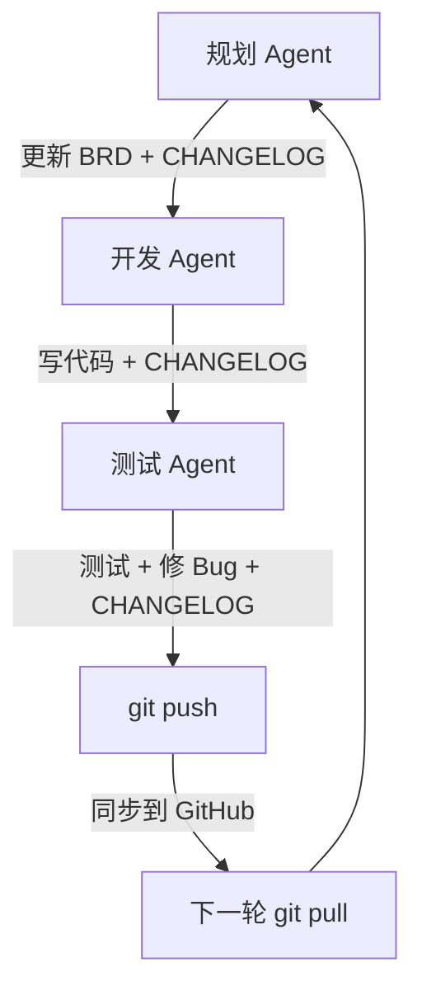

<div align="center">

# 🤖 AllAgentBASE

**多 Agent 协作的项目同步与管理平台**

*让 AI 助手在 GitHub 上接力干活，规划、开发、测试一条龙*

[](https://github.com/SSaans/AllAgentBASE)
[](LICENSE)
[](https://github.com/SSaans/AllAgentBASE/commits)

[快速开始](#-快速开始) · [工作流程](#-工作流程) · [文档规范](#-文档规范) · [常见问题](#-常见问题)

</div>

---

## ✨ 核心特性

| 特性 | 说明 |
|------|------|
| 📋 **统一需求管理** | BRD.md 是**平台级**需求的唯一真相来源（子项目需求见各子项目 BRD，根 BRD 只做索引），所有 Agent 基于此工作 |
| 🔄 **接力式协作** | 规划 → 开发 → 测试，每个 Agent 完成后记录交接日志 |
| 🔗 **GitHub 同步** | 实时推送工作成果，多人/多 Agent 无缝衔接 |
| 📝 **变更追踪** | CHANGELOG.md 记录每次改动，下一轮必读 |
| 🚫 **职责边界** | 明确每个 Agent 能做什么、不能做什么 |

---

## 🎯 这是什么？

AllAgentBASE 不是让多个 Agent **同时乱改**，而是让它们在 **同一个项目、同一套规则** 下 **分工接力**：

```
规划 Agent 审代码补需求 ─→ BRD.md + CHANGELOG.md
          ↓
开发 Agent 照着 BRD 写代码 ─→ 代码 + CHANGELOG.md ─→ git push
          ↓
测试 Agent 读 BRD 验收标准 ─→ 测试 + Bug 修复 ─→ git push
          ↓
        回到规划 Agent（下一轮）
```

---

## 🚀 快速开始

### 第一步：创建 GitHub 仓库

1. 去 [github.com/new](https://github.com/new) 创建一个新仓库
2. 选择 **Private**（私有）或 **Public**（公开）
3. 复制仓库地址（类似 `https://github.com/你的用户名/仓库名.git`）

### 第二步：初始化项目

把项目模板复制到你的目录，然后连接 GitHub：

```bash
# 把项目模板复制到你的目录后
cd 你的项目目录

# 初始化并连接 GitHub
git init
git remote add origin https://github.com/你的用户名/仓库名.git
# ⚠️ 逐路径 add，不要用 `git add .`
#    仓库根常有 Agent 宿主目录（.claude/ .workbuddy/）与本机产物，
#    `git add .` 会把它们一起传上去
git add README.md .gitignore
git commit -m "初始化项目"
git push -u origin main
```

### 第三步：填写需求文档

打开 `BRD.md`，写清楚你要做什么：

```markdown
## 项目目标
做一个 XXX 功能

## 核心功能
- 功能 A：...
- 功能 B：...

## 验收标准
- [ ] 能够完成 XXX
- [ ] 通过 XXX 测试
```

### 第四步：让 Agent 接力干活

**规划 Agent**（第一棒）
```
你：「帮我看看这个项目，把 BRD 补充完整，规划一下技术方案」
Agent：（读代码 + 补充 BRD + 记录 CHANGELOG）
```

**开发 Agent**（第二棒）
```
你：「根据 BRD.md 开发功能」
Agent：（自己读 BRD + CHANGELOG → 写代码 → 记录 CHANGELOG → 自行 git commit + push）
```

**测试 Agent**（第三棒）
```
你：「按照 BRD 的验收标准测试功能」
Agent：（读 BRD + CHANGELOG → 测试 → 修 Bug → 记录 CHANGELOG → 自行 git commit + push）
```

每次 Agent 干完活，由 Agent 提交本轮改动并运行：
```bash
git add <本轮改动的文件>   # ⚠️ 逐路径列出，不要 `git add .`
git commit -m "Agent：<简述>"
git push
```

下次继续前，先拉取最新：
```bash
git pull
```

---

## 📂 项目结构

```
你的项目/
├── AGENTS.md            # Agent 行为规范入口 + skill 路由（开工必读）
├── BRD.md               # 业务需求文档（平台级需求真相来源；子项目需求见各子项目 BRD）
├── PLANNING.md          # 规划 Agent 操作手册
├── DEVELOPMENT.md       # 开发 Agent 操作手册（含本机路径基线 + Git 应急手册）
├── TESTING.md           # 测试 Agent 操作手册
├── Task.md              # 平台级任务看板
├── CHANGELOG.md         # 变更日志（Agent 交接棒，15 条上限）
├── CHANGELOG.archive.md # 超限条目归档
├── README.md            # 项目说明（本文件）
├── LICENSE              # MIT 许可证
├── .gitignore           # Git 忽略规则
├── Guide/               # 工作流程图文指南
├── Project/             # 子项目（每个含 BRD / README / Task / CHANGELOG 四件套）
└── skill/               # 规划 / 开发 / 测试三张执行卡 + 通用 skill

> 🔒 **上图之外，仓库根还可能「多出」一批本机产物** —— Agent 宿主本地目录（`.claude/`、`.workbuddy/`）、在仓库根跑 Agent / 建项目留下的克隆副本（如 `Programdistilly/`）、运行噪音（`*.log`、`temp/`）。它们**不属于本仓库、一律不入仓**，由 `.gitignore` 兜底。收件范围与三道防线见 `AGENTS.md` 的「🔒 入库收件范围」节。
```

---

## 🔄 工作流程



### Agent 上岗检查清单

每个 Agent 开始工作前，必须完成：

- [ ] 读完 `BRD.md` 全文
- [ ] 读完 `CHANGELOG.md` 最近 3 条记录
- [ ] 浏览当前代码结构
- [ ] 明确自己的职责边界（见 `AGENTS.md`）

---

## 📋 文档规范

### BRD.md（业务需求文档）

**作用**：项目的唯一真相来源

**内容**：
- 项目目标
- 核心功能列表
- 技术方案
- 验收标准
- 不做的事情（边界）

**维护者**：规划 Agent

### CHANGELOG.md（变更日志）

**作用**：Agent 之间的"交接棒"

**格式**：
```markdown
## [2026-09-06] 开发 Agent
- 完成了 XXX 功能
- 修改了 XXX 文件
- 下一步建议：XXX

## [2026-09-05] 规划 Agent
- 补充了技术方案
- 更新了验收标准
- 下一步：交给开发 Agent 实现
```

**规则**：
- 每次改动必须记录
- 说清楚"做了什么"和"下一步做什么"
- 新记录放在最上面

### AGENTS.md（Agent 行为规范入口 + skill 路由）

开工必读的统一入口：先按任务类型查 skill 路由表，再读对应 SOP。三个 Agent 的职责边界：

| Agent | 负责 | 禁止 |
|-------|------|------|
| **规划 Agent** | 审代码、补需求、规划方案 | 不能写代码、不能测试 |
| **开发 Agent** | 照着 BRD 写代码 | 不能改需求、不能跳过测试 |
| **测试 Agent** | 按验收标准测试、报 Bug | 不能改需求、不能大改代码 |

---

## 🛡️ 干活规矩

1. **开始前必读**：BRD.md + CHANGELOG.md 最近 3 条
2. **先轮流做**：不要同时改同一个文件
3. **做完记日志**：在 CHANGELOG.md 里写清楚改了啥
4. **推送同步**：每次干完活 `git push` 一下
5. **拉取更新**：下次开始前 `git pull` 一下
6. **不传秘密**：密码、API Key 等绝对不能提交
7. **只加自己的文件**：`git add` 逐路径列出，**绝不用 `git add .`** —— 仓库根混着 Agent 宿主目录（`.claude/`、`.workbuddy/`）和本机产物，`.` 会把它们一起传上去

---

## ❓ 常见问题

### Q: 多个 Agent 能同时工作吗？

**A:** 能，但要避免同时改同一个文件。建议按"规划 → 开发 → 测试"顺序接力。

### Q: CHANGELOG 写太多会不会很乱？

**A:** 不会。各级 `CHANGELOG.md` 保持 15 条上限，超出部分归档进同目录**已有的** `CHANGELOG.archive.md`（不新建文件）。

### Q: 忘记 push 怎么办？

**A:** 未推送的提交仍只在本机。Agent 应检查状态并执行 `git push`；网络失败按网络错误处理，不能靠 pull 代替 push。

### Q: 能不能跳过测试直接合并？

**A:** 不建议。测试 Agent 的作用是保证代码质量，跳过测试容易埋坑。

---

## 🤝 贡献指南

欢迎提 Issue 和 Pull Request！

1. Fork 本仓库
2. 创建你的分支 (`git checkout -b feature/amazing-feature`)
3. 提交改动 (`git commit -m 'Add some amazing feature'`)
4. 推送到分支 (`git push origin feature/amazing-feature`)
5. 提交 Pull Request

---

## 📄 许可证

本项目采用 MIT 许可证。详见 [LICENSE](LICENSE) 文件。

---

## 🌟 Star 历史

如果这个项目对你有帮助，请给个 Star ⭐️

---

<div align="center">

**Made with ❤️ by the AllAgentBASE Team**

[返回顶部](#-allagentbase)

</div>
